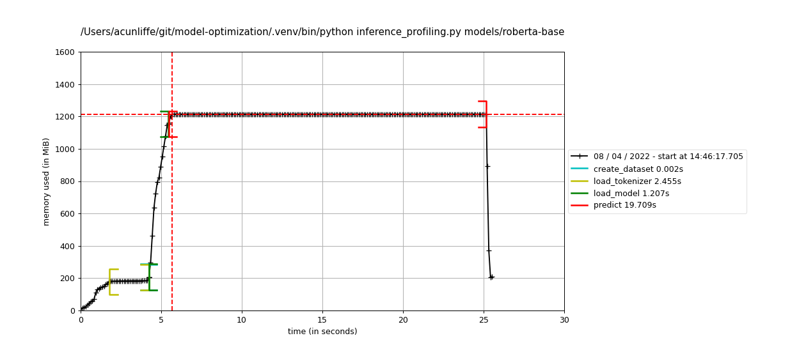
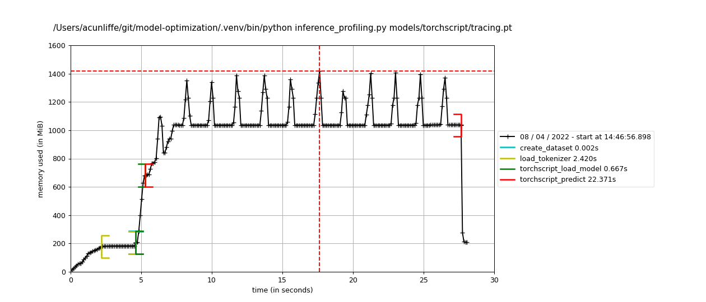

# A Crash Course on Model Compression for Data Scientists

Deep learning models are wildly effective at solving complex problems with unstructured data. Unfortunately, they are also (usually) big, slow to run, and resource intensive. In today’s post, I will talk about some different options to reduce the size, inference time, and computational footprint for trained deep learning models in production. I will focus mainly on inference using CPUs rather than GPUs, which can be a good option when trying to minimize cost. CPUs are also generally around an order of magnitude slower to run inference with than GPUs, meaning that model compression, when done effectively, can have a huge impact in a CPU deployment setting. Furthermore, I’ll mainly focus on transformer models and PyTorch, though the topics I’ll cover are generally applicable across deep learning models and frameworks.

*But wait, isn’t it the job of the <machine learning engineer, software dev, data engineer, DevOps team, IT team> to figure out how to deploy my models into production?*

As a data scientist, your primary job is to deliver business value using data. This means that, more often than not, you will be involved to some extent in every aspect of the problem you are working on, from data collection to model development to defining meaningful metrics to interacting with business partners to weighing deployment options. You don’t need to become an expert in data pipelines or auto-scaling (or, for that matter, medicine, law, e-commerce, finance, or whatever field you are working in), but you do need to understand just enough about different parts of the process to anticipate how each decision will affect the ultimate impact of the solution you are building.

It is my goal to help you understand the basic choices that exist around model compression, and to arm you with enough information to weigh in on the options and the potential tradeoffs should be considered.

So with that, let’s get started…

## What is Model Compression?

Model compression refers to the practice of modifying model loading/storage to decrease the resource usage and/or improve the latency for that model. For deep learning models, we should ask ourselves three basic questions:

- Disk space: How much hard disk space is consumed by the model?
- Memory usage: When the model is loaded into memory (RAM or GPU memory), how much memory is consumed?
- Latency: How long does it take to load the model into memory? Once a model is loaded, how much time is required to perform inference on a sample or batch?

Knowing the answers to these questions can help your team determine requirements for infrastructure to serve models, as well as opportunities for parallellization, auto-scaling, etc.

Additionally, we should consider the impact that any compression technique will have on the model predictions themselves. Ideally, model predictions should not change; however, the majority of the techniques that we'll discuss result in changes to the inference results, impacting the accuracy/precision/recall of the trained model. As data scientists, we can measure important metrics and determine if any degradation is worth the gain in speed, size, etc.

Before we dive into model compression techniques, let’s start by establishing a baseline. We’ll load a [RoBERTa](https://huggingface.co/roberta-base) transformer model available through Hugging Face and use it to classify the first few sentences of my favorite book, Alice in Wonderland. The code is available [here](https://github.com/prolego-team/model-optimization) if you'd like to follow along. Throughout this, we’ll use a neat [memory profiler](pypi.org/project/memory-profiler) to track RAM consumption and run time:[^1]

    def profile_memory(model_path):
        model_name = model_path.replace("/", "_")
        model_name = model_name.replace(".", "")
        command = "mprof run --interval 0.1 inference_profiling.py " + model_path + "; mprof plot -o plots/" + model_name + ".png -w 0,30"
        os.system(command)

    profile_memory("roberta-base")

The total memory consumption for this model is close to 1600 MiB, and the total run time is roughly 25 seconds, with the inference step itself requiring the bulk of the time. The saved model takes up about 500 MB in hard drive space. Now let's look at some types of model compression techniques and the impact that they can have on resource usage and latency.

[^1] The actual run time and memory consumption will be influenced by system setup (e.g., CPU clock speed, multi-threading) as well as model parameters (e.g., batch size, maximum numer of tokens). For the purposes of this post, I am keeping these factors fixed when applicable in order to facilitate a fair comparison. The important thing is to focus on the comparison between different techniques rather than the raw numbers themselves. For the record, I’m using a MacBook Pro with a 2 GHz Quad-Core Intel Core i5 processor. You can check out parameter definitions, code, and results in the [code repository](https://github.com/prolego-team/model-optimization).

## Types of Model Compression

There are three commonly used model compression techniques to be aware of:
1. Serialization
2. Quantization
3. Pruning

We’ll talk through each individually and test out our Alice in Wonderland example for each.

### Serialization

Serialization encodes a model in a format that can be stored to disk and reloaded (deserialized) when needed. Provided a model is serialized using a common framework, serialization methods can also facilitate interoperability, allowing for deployment using a system that is different from the development environment.

The most commonly used serialization approach for deep learning models is the [Open Neural Network Exchange (ONNX)](https://onnx.ai) format, which represents networks as a computation graph. Models that are saved using the ONNX format can be run using [ONNX Runtime](https://github.com/microsoft/onnxruntime). ONNX Runtime also provides tools for model quantization - something we’ll revisit in the next section.

Let’s convert our RoBERTa model to the ONNX format and re-run the memory profiler:

    python -m transformers.onnx --model=roberta-base --feature=sequence-classification onnx/

    profile_memory("onnx/model.onnx")

Neither the peak memory consumption (~1.5GiB) nor the model size (500MB) are dramatically reduced, but the runtime for CPU inference has decreased dramatically from 20s to 6s.

PyTorch also provides native [serialization using TorchScript](pytorch.org/docs/stable/jit.html). There are two types of serialization - scripting and tracing. During tracing, sample input is fed into the trained model and followed (traced) through the model computation graph, which is then frozen. At the time of this writing, only tracing is supported for transformer models, so that is the method we will use:

    import model_utils

    def torchscript_trace(model, tokenizer):
        """
        trace a transformer model using torch.jit.trace
        """
        model.eval()
        inputs = tokenizer.encode_plus(
            "sample text",
            return_tensors = 'pt')
        with torch.no_grad():
            # strict=False needed for quantization
            torchscript_model = torch.jit.trace(model, [inputs["input_ids"], inputs["attention_mask"]], strict=False)
        return torchscript_model

    def torchscript_save(torchscript_model, output_filepath):
        """
        save a traced model to output_filepath
        """
        torch.jit.save(torchscript_model, output_filepath)

    # trace model and save
    model = model_utils.load_model("roberta-base", torchscript=True)
    tokenizer = model_utils.load_tokenizer("roberta-base")
    traced_model = torchscript_trace(model, tokenizer)
    torchscript_save(traced_model, "torchscript/tracing.pt")

    # memory profiling
    profile_memory("torchscript/tracing.pt")

Before we move on to Quantization, let's lay out what we have measured so far:

|                           | Peak RAM Consumption (GiB) | Hard Disk Space (MB) | Model Loading Time (s) | Inference Time (s) |
|---------------------------|:-------------------------:|:--------------------:|:----------------------:|:------------------:|
| Baseline                  | 1.6                       | 500                  | 1.4                    | 19                 |
| ONNX Serialization        | 1.5                       | 500                  | 0.9                    | 6                  |
| TorchScript Serialization | 1.4                       | 500                  | 0.5                    | 21                 |

Through ONNX serialization, we've managed to significantly reduce inference time, but we haven't made much of a dent in the other areas (model size, RAM usage). The techniques we'll cover next will help reduce the memory and hard disk footprints of these large transformer models.

### Quantization

Deep learning frameworks generally operate using floating point (32 bit precision) numbers, which makes sense during training but may be unnecessary during inference. Quantization describes the process of converting floating point numbers to integers. There are two types of quantization that can be applied after a model has been trained: dynamic or static.[^2] During dynamic quantization, model weights are stored using their 8 bit representations, while activations are quantized at the time of compute but stored as full-precision floats. For static quantization, both weights and activations are stored using 8 bit precision. Compared with static quantization, dynamic quantization may provide a boost in accuracy at the cost of increased runtime. For a more in-depth tutorial on model quantization, check out this post on [Practical Quantization in PyTorch](https://pytorch.org/blog/quantization-in-practice).

For transformer models, dynamic quantization is generally recommended[^3] because 1) it is a simpler and more accurate approach than static quantization, and 2) due to the larger size of the model (number of weights), the biggest gains for transformers can be made by reducing the footprint of the weights. Let’s apply dynamic quantization to our model and measure the effects. We will try out both dynamic quantization available through PyTorch and through ONNX runtime:

    # PyTorch
    import torch
    # load model and tokenizer
    model = model_utils.load_model("roberta-base", torchscript=True)
    tokenizer = model_utils.load_tokenizer("roberta-base")
    # quantize
    model_int8 = torch.quantization.quantize_dynamic(
        model,
        {torch.nn.Linear},
        dtype=torch.qint8
    )
    # save
    torchscript_model = torchscript_trace(model_int8, tokenizer)
    torchscript_save(torchscript_model, os.path.join("pytorch_quantized", "model.pt"))

    # ONNX Runtime
    from onnxruntime.quantization import quantize_dynamic, QuantType
    quantize_dynamic(onnx_model_path, "onnx_quantized", weight_type=QuantType.QInt8)

    # memory profiling
    profile_memory("pytorch_quantized/model.pt")
    profile_memory("onnx_quantized/model.onnx")

|                                                  | Peak RAM Consumption (GiB) | Hard Disk Space (MB) | Model Loading Time (s) | Inference Time (s) |
|--------------------------------------------------|:-------------------------:|:--------------------:|:----------------------:|:------------------:|
| Baseline                                         | 1.6                       | 500                  | 1.4                    | 19                 |
| ONNX Serialization                               | 1.5                       | 500                  | 0.9                    | 6                  |
| Serialization & Quantization (ONNX)                | 0.9                       | 125                  | 0.4                    | 3                  |
| TorchScript Serialization                        | 1.4                       | 500                  | 0.5                    | 21                 |
| Serialization & Quantization (TorchScript / PyTorch) | 1.2                       | 240                  | 0.8                    | 8                  |

Both quantization methods reduce inference time compared to their larger counterparts. Additionally, hard disk space usage has been reduced by more than 50%. Based on these results, quantization seems like a no-brainer - why would you not do this? Before deploying a quantized model, there is one additional factor to consider, namely, how these changes affect the model predictions.

[^2] There is also a third type of quantization called quantization-aware training (QAT). During training, weights and activations are “fake quantized,” meaning that computations are performed with floating point numbers, but float values are rounded to mimic 8 bit integer values for forward/backward passes. Because quantization occurs as part of model training, QAT is less likely degrade metrics. However, the implementation of QAT is somewhat more complicated. My current recommendation would be to start with a simple approach like dynamic quantization and move on to QAT only if you observe a degradation that is not acceptable for your particular use case.

[^3] https://pytorch.org/docs/stable/quantization.html#prototype-fx-graph-mode-quantization

### Effect of Quantization on Metrics

Because quantization modifies the weights of a trained network, it will inevitably affect the scores output by the final layer of the model. Particularly if a score is close to a decision threshold, a quantized model can yield predictions that are different from those that are output by the original, un-quantized model. Prior to deploying a model that has been quantized, it’s a good idea to run inference on a test set, measure metrics, and examine examples where the predicted output has changed from that of the original model.

Let’s examine how quantization may affect model performance. For this example, we’ll consider the task of sentiment analysis using [cardiffnlp/twitter-roberta-base-sentiment](https://huggingface.co/cardiffnlp/twitter-roberta-base-sentiment), a RoBERTa model available through Hugging Face that has been trained on Twitter excerpts. Tweets can be assigned to one of three sentiment categories - negative, positive, or neutral. For both the original and quantized models, we'll perform inference on 100 examples, generate a confusion matrix, and measure accuracy.

    model_name = "cardiffnlp/twitter-roberta-base-sentiment"

    # baseline
    import os
    command = "python -m sentiment_inference " + model_name
    os.system(command)

    # ONNX quantization
    from optimize_models import to_onnx, quantize_onnx_model
    to_onnx(model_name, "onnx-sentiment")
    quantize_onnx_model("onnx-sentiment/model.onnx", "onnx-sentiment/quantized-model.onnx")
    os.system("python -m sentiment_inference onnx-sentiment/quantized-model.onnx")

    # PyTorch quantization
    from optimize_models import quantize_pytorch_model
    quantize_pytorch_model(model_name, model_name, "quantized-sentiment")
    os.system("python -m sentiment_inference "quantized-sentiment/model.pt")

|                  | Baseline     | ONNX Quantization | PyTorch Quantization |
|------------------|--------------|-------------------|----------------------|
| Accuracy         | 0.70         | 0.69              | 0.71                 |
|                  | [[19 10  0]  | [[19  9  1]       | [[18 11 0]           |
| Confusion Matrix |  [13 37  5]  |  [13 37  5]       |  [10 40 5]           |
|                  |  [ 1  1 14]] |  [ 1  2 13]]      |  [0  3 13]]          |

While the general performance of the model appears relatively uneffected, quantization has changed some of the predictions. In this situation, it would be beneficial to examine some of the examples with altered predictions prior to deploying the quantized model.

### Pruning

Pruning refers to the practice of ignoring or discarding “unimportant” weights in a trained model. This begs the question - how do you determine which weights are unimportant? In the section below, I will discuss three methods for model pruning:

1. Magnitude Pruning

One way to identify unimportant weights is to look at their absolute values, since weights with low absolute value have little impact on the values being passed through the model. This approach, called magnitude pruning, is mostly effective for models trained from scratch for a specific task since the values of the weights dictate importance for the task the model was trained on. In transfer learning, however, the values of the weights are also related to the task used to pre-train the network rather than the fine-tuning task. This brings us to the next approach:

2. Movement Pruning

During movement pruning, weights that shrink in absolute value during training are discarded. This approach is well-suited for transfer learning, as the movement of weights from large to small demonstrates that they were unimportant (actually, counterproductive) for the fine-tuning task. In their 2020 paper, [Movement Pruning: Adaptive Sparsity by Fine-Tuning](https://arxiv.org/pdf/2005.07683v2.pdf), Sanh et al. demonstrated that movement pruning applied to a fine-tuned BERT model was better able to adapt to the end-task than magnitude pruning, yielding 95% of the original performance for natural language inference and question answering with only 5% of the encoder’s weight.

3. Pruning Attention Heads

One differentiating architectural feature of transformer models is the employment of multiple parallel attention “heads”. In their 2019 paper,  [Are Sixteen Heads Really Better than One?](https://arxiv.org/abs/1905.10650), Michel et al. showed that models trained with many heads can be pruned at inference time without significantly affecting performance. We will test the impact of pruning N% of heads on performance below. Note that because we're only interested in measuring resource usage, we'll prune heads randomly. For a real-world application, however, heads should be pruned based on their relative importance.

    def prune_random_heads(model_name, frac_heads_per_layer, output_dir):
        """
        randomly prune fractional number of attention heads per layer from a model and save to output_dir
        """
        model = model_utils.load_model(model_name)
        tokenizer = model_utils.load_tokenizer(model_name)
        n_layers, n_heads = model.config.num_hidden_layers, model.config.num_attention_heads
        heads_to_prune = list(range(int(n_heads * frac_heads_per_layer)))
        heads_to_prune = {layer: heads_to_prune for layer in range(n_layers)}
        model.prune_heads(heads_to_prune)
        model.save_pretrained(output_dir)
        tokenizer.save_pretrained(output_dir)

    prune_fraction = [("25percent", 0.25),
                      ("50percent", 0.5),
                      ("90percent", 0.9)]
    for percent_name, fraction in prune_fraction:
        saved_model_dirpath = "pruned/" + percent_name
        # pruning
        prune_random_heads("roberta-base", fraction, saved_model_dirpath)
        # profiling
        profile_memory(saved_model_dirpath)

|              | Peak RAM Consumption (GB) | Hard Disk Space (MB) | Model Loading Time (s) | Inference Time (s) |
|--------------|:-------------------------:|:--------------------:|:----------------------:|:------------------:|
| Baseline     | 1.6                       | 500                  | 1.4                    | 19                 |
| Pruned - 25% | 1.4                       | 470                  | 1.5                    | 18                 |
| Pruned - 50% | 1.25                      | 440                  | 1.7                    | 17                 |
| Pruned - 90% | 1.2                       | 400                  | 1.3                    | 12                 |

For our RoBERTa model, we need to prune the majority of heads to observe a noticeable impact on resource usage and inference time.

### Change the Model Architecture

I’d be remiss if I didn’t mention this final option: To reduce the size or increase the speed of a model, why not just use a smaller model? While this isn’t a model compression technique per se, it is worth discussing since can accomplish the same goal of reducing resource usage and improving latency.

One potential drawback of decreasing model size is that it can result in a substantial hit to performance. An approach called knowledge distillation addresses this shortcoming using a student-teacher approach: During training, a smaller model (“student”) is trained to mimic the behavior of a larger model or ensemble of models (“teacher”). This methodology was applied to transformers in the [DistilBERT paper](https://arxiv.org/abs/1910.01108) in 2019, where the authors demonstrated similar performance as BERT on the GLUE benchmark dataset at 40% of the size.

To train the student model, the authors use a triple loss function:
1. A standard masked language modeling (MLM) objective
2. Distillation loss - similarity between output probability distribution of student and teacher models
3. Cosine distance similarity between student and teacher hidden states

The first objective (MLM) is the same objective function that is used to train a standard BERT model. The second two objectives (distillation loss and cosine distance), however, encourage the model to yield similar intermediate and final results as the larger teacher model. We can implement the student-teacher approach for our own trained model, though this is not a trivial task. Alternatively, we can use a DistilBERT-flavor foundation model as a starting point and fine-tune on our specific data.

Let’s test the performance of [DistilRoBERTa](https://huggingface.co/distilroberta-base) compared with the larger RoBERTa model:

|               | Peak RAM Consumption (GB) | Hard Disk Space (MB) | Model Loading Time (s) | Inference Time (s) |
|---------------|:-------------------------:|:--------------------:|:----------------------:|:------------------:|
| Baseline      | 1.6                       | 500                  | 1.4                    | 19                 |
| DistilRoBERTa | 1.2                       | 330                  | 0.9                    | 10                 |

By using a DistilRoBERTa model, we've cut down on size, latency, and RAM usage even more than we did by pruning 90% of attention heads.

## Putting It All Together

We've examined multiple methods individually for model compression. In all likelihood, you'll want to combine multiple techniques together to have the biggest impact. Based on the measurements that we've made, most middle-of-the-road applications will benefit from considering these techniques in the following prority order:

1. ONNX serialization
2. `+ Quantization using ONNX
3. Use DistilRoBERTa architecture (still serialize/quantize with ONNX)
4. `+ Prune attention heads

In the chart below, I show the results of applying these techniques sequentially:

|                                                  | Peak RAM Consumption (GB) | Hard Disk Space (MB) | Model Loading Time (s) | Inference Time (s) |
|--------------------------------------------------|:-------------------------:|:--------------------:|:----------------------:|:------------------:|
| Baseline (RoBERTa)                                         | 1.6                       | 500                  | 1.4                    | 19                 |
| + ONNX Serialization                               | 1.5                       | 500                  | 0.9                    | 6                  |
| + ONNX Quantization | 0.9                       | 125                  | 0.4                    | 3                  |
| DistilRoBERTa (with ONNX Serialization/Quantization) | 0.9                       | 80                  | 0.2                    | 2 |
| + Pruning (90%)                | 0.6                       | 70                  | 0.2                    | 1                  |

ONNX serialization has substantially decreased inference time without changing model predictions. Quantization has decreased hard disk usage, as well as further reduced inference time. As we saw previously, we can expect quantization to somewhat impact model predictions, though likely not substantially. Using a smaller architecture like DistilRoBERTa further reduces hard disk usage and inference time. However, it requires model training/retraining using a different architecture, which has the potential to substantially impact model metrics. The extent of the impact is likely data-dependent, so we would need to test with a specific use-case/dataset to determine the impact. Compared to these three techniques, pruning is a method I would recommend only in extreme situations where it is critical to eke out slightly better performance - while we do see some gains compared with simply using the DistilRoBERTa model, it is substantially more effort to implement an intelligent strategy for determining which heads to prune than to, say, swap in a DistilBERT foundation model rather than a BERT model.

TLDR: For most middle-of-the-road scenarios, I would generally recommend an approach that balances speed and compute gains with ease of implementation: With the currently available tools and libraries, you’re going to get the most bang for your buck by simply performing ONNX serialization and quantization on your models, and potentially using a smaller model architecture like DistilBERT if the performance hit is acceptable.

## Conclusion

There is a lot of information out there about model compression, so I hope you've found this guide both practical and useful for synthesizing that information and identifying where to start. Finally, while this analysis focused mainly on CPU inference (the cheaper option), for near-realtime inference, running inference on GPU-enabled instances may be preferable. In my next post, I'll dive into some analyses of model compression that are specific to GPU inference. In the mean time, happy modeling!